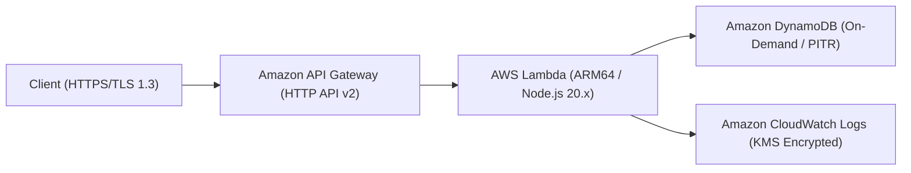

# Serverless API Dual-Blade ⚡

> **Terraform × AWS CDK 二刀流** で実現する、堅牢かつ高可用な完全サーバーレス RESTful API 基盤リファレンス実装。

---

## 🌟 プロジェクト概要

本プロジェクトは、AWSマネージドサービスを極限まで活用した「API Gateway + AWS Lambda + Amazon DynamoDB」による完全サーバーレス構成を、**Terraform** と **AWS CDK (TypeScript)** の双方で完全に等価再現したIaC（Infrastructure as Code）二刀流プロジェクトです。

チームのスキルセット、パイプライン要件、プロジェクトのライフサイクルに応じて、宣言型（Terraform）とプログラマブル型（CDK）の最適なアプローチを相互に検証・選択できます。

### 主な特徴・インフラのポイント
- **高パフォーマンス & 低コスト**: HTTP API (v2) と AWS Graviton3 (ARM64) 採用 Lambda の組み合わせ。
- **予測不能なスパイクへの即応**: DynamoDB オンデマンドキャパシティ + PITR (ポイントインタイムリカバリ) 有効化。
- **最小権限 & ゼロトラスト境界**: 各種リソースに対する最小権限IAMポリシー、通信全暗号化 (TLS 1.3)、KMSによる保存時暗号化。
- **二刀流 IaC 保証**: Terraform (`terraform apply`) と AWS CDK (`cdk deploy`) のどちらからでも本番水準の同一アーキテクチャを展開可能。

---

## 🏗️ システム構成図



---

## 📁 ディレクトリ構造

```text
.
├── src/                      # Lambda アプリケーションコード (TypeScript / Node.js)
│   └── index.ts
├── terraform/                # Terraform 実装環境
│   ├── envs/
│   │   └── prod/             # 環境定義 (main.tf, variables.tf, outputs.tf)
│   └── modules/              # 再利用可能モジュール群 (apigateway, api_backend, dynamodb)
├── cdk/                      # AWS CDK 実装環境 (TypeScript)
│   ├── bin/
│   │   └── app.ts            # CDK エントリポイント
│   ├── lib/
│   │   ├── api-stack.ts      # API Gateway 統合スタック
│   │   └── backend-stack.ts  # Lambda & DynamoDB バックエンドスタック
│   └── test/                 # CDK 単体テスト (@aws-cdk/assertions)
└── README.md                 # 本ドキュメント
```

---

## 🚀 展開手順 (Deployment)

お好みの IaC ツールを選択して展開してください。

### Option A: Terraform での展開

```bash
cd terraform/envs/prod

# 初期化
terraform init

# 計画確認
terraform plan

# デプロイ
terraform apply
```

### Option B: AWS CDK での展開

```bash
cd cdk

# 依存関係インストール
npm ci

# 単体テスト & 静的検査 (cdk-nag)
npm test

# デプロイ
npx cdk deploy --all
```

---

## 🎬 キャスト (クレジット)

- agent🔵 : 要件定義・アーキテクチャ策定（完全サーバーレス構想策定）
- agent🍇 : 技術選定・IaC二刀流ブループリント設計
- agent🍊 : Terraformモジュール & AWS CDKスタック超速実装
- agent🟢 : 静的セキュリティ解析 (tfsec / trivy) & 品質保証
- agent🟡 : プロジェクトプロデュース・統合ディレクション
